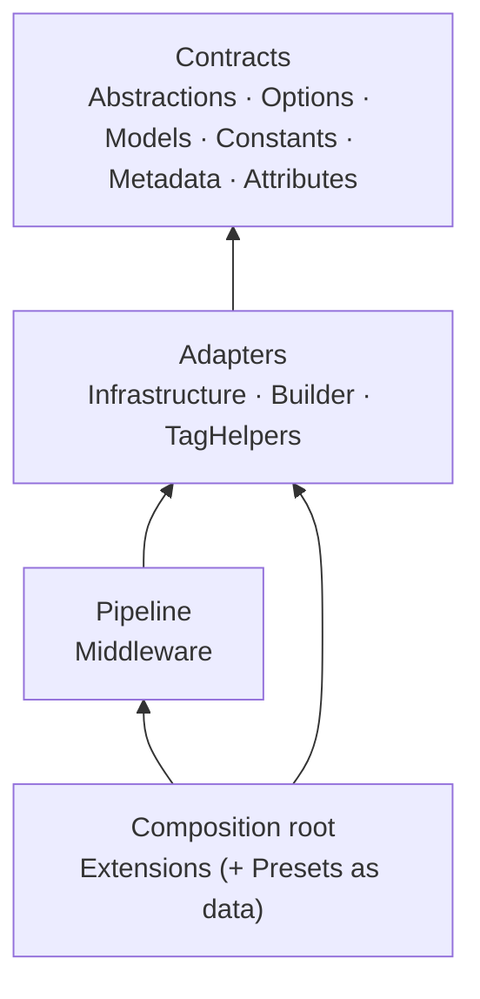
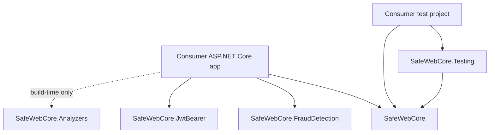
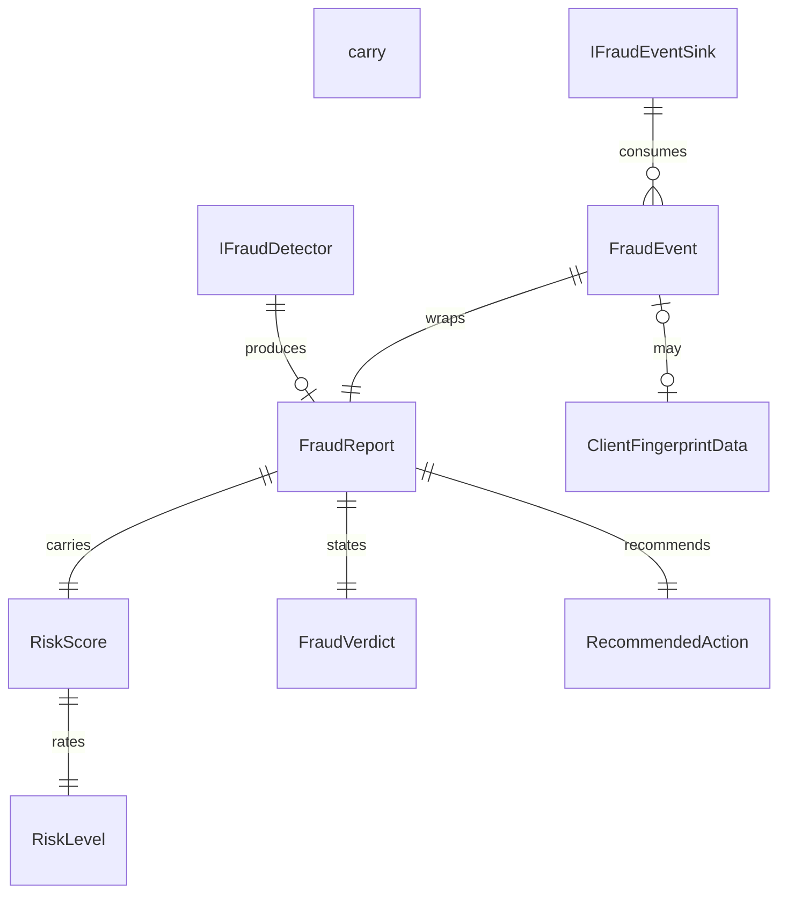

# Architecture Spine — SafeWebCore

## Design Paradigm

**Layered, with ports and adapters.** Contracts are the ports, every implementation sits behind them, and exactly one layer wires them together. The ASP.NET Core middleware pipeline is one filter inside that model, not the organising idea: what stays consistent across the family is the contract surface, not the pipeline.

| Layer | Namespaces and folders | Owns |
| --- | --- | --- |
| Contracts (ports) | `Abstractions`, `Options`, `Models`, `Constants`, `Metadata`, `Attributes`; in FraudDetection `Abstractions`, `Options`, `Models` | interfaces, option groups, value records, header-name and trigger constants |
| Adapters | `Infrastructure`, `Builder`, `TagHelpers`; in FraudDetection `Infrastructure`, `Detection`, `Extensions` | internal implementations of the ports and the fluent builders |
| Pipeline | `Middleware` | the request filter that emits headers |
| Composition root | `Extensions` | the only place that registers services and adds middleware; `Presets` is data it consumes |
| Distribution | `SafeWebCore.Analyzers`, `SafeWebCore.Testing` | build-time diagnostics and test helpers; outside the runtime graph |

## Invariants & Rules

Nineteen decisions fix what a future builder cannot read off compliant code. The rationale behind each one lives in `.memlog.md`, not here. AD-10 was amended and AD-16 to AD-19 were added on 2026-09-27, when the five questions this run carried were decided. All four rules that carried an *implementation pending* status were implemented the same day — both dispatchers isolate a throwing sink per sink and count the swallowed failure, `RiskScore.FromScoreAndVerdict` and the shared `FraudVerdictMapping` fail closed, `SafeWebCore.FraudDetection` carries the three-part `1.1.0`, and the validator rejects an `AdditionalHeaders` entry that names a library-owned header — so every rule below is backed by code and tests.

### AD-1 — Packages are independent siblings [ADOPTED]

- **Binds:** all five packages under `src/`
- **Prevents:** a sideways reference between SafeWebCore packages that couples their versions, duplicates the header pipeline, or leaks one package's internals into another package's surface.
- **Rule:** no `ProjectReference` and no `PackageReference` from one `SafeWebCore.*` package to another. One exception: `SafeWebCore.Testing` → `SafeWebCore`. Shared behaviour is promoted into `SafeWebCore` as public API or duplicated deliberately, never referenced sideways.
- **Evidence:** zero project references between the four libraries (verified 2026-09-27).

### AD-2 — One-way dependency direction, single composition root [ADOPTED]

- **Binds:** all packages
- **Prevents:** infrastructure types appearing in public signatures, the pipeline reaching into detector internals, and registration logic scattered outside `Extensions`.
- **Rule:** contracts depend on nothing else in their package; adapters and the pipeline may depend on contracts and on adapters; only `Extensions` composes. Nothing in the family depends on `SafeWebCore.Analyzers`.



### AD-3 — Additive-only public API, enforced by the PublicAPI baseline [ADOPTED]

- **Binds:** SafeWebCore, SafeWebCore.FraudDetection, SafeWebCore.JwtBearer
- **Prevents:** an agent renaming, removing or re-meaning a shipped symbol, and unrecorded public surface that later blocks a release review.
- **Rule:** never remove or rename a symbol listed in `PublicAPI.Shipped.txt`; add intentional new public API to `PublicAPI.Unshipped.txt` in the same change; keep XML documentation on all public API; fix `RS0037` rather than suppressing it; a breaking change is a deliberate major-version decision, never incidental. `SafeWebCore.Analyzers` and `SafeWebCore.Testing` carry no baseline.
- **Evidence:** `WarningsAsErrors: RS0037` and `WarningsNotAsErrors: RS0016;RS0017` in the three csproj files, and the backward-compatibility policy.

### AD-4 — Misconfiguration fails at startup with an actionable message [ADOPTED]

- **Binds:** SafeWebCore, SafeWebCore.FraudDetection, SafeWebCore.JwtBearer
- **Prevents:** divergent failure modes, where one unit returns library defaults for invalid configuration and another throws from the request path.
- **Rule:** every option group has an `IValidateOptions<T>` implementation and is registered with `.ValidateOnStart()`; each failure message names its scope (global or the specific path policy) and ends with an explicit `Fix:`; the request path never throws for configuration problems and never silently coerces a value.
- **Evidence:** `NetSecureHeadersOptionsValidator`, `FraudDetectionOptionsValidator`, and the JwtBearer configuration validators.

### AD-5 — Per-request state lives only in `HttpContext.Items` [ADOPTED]

- **Binds:** all runtime packages
- **Prevents:** one unit caching request data in a singleton (cross-request leakage) while another stores it in the request, and an accidental scoped lifetime that changes the service contract for every consumer.
- **Rule:** no `AddScoped` registrations. The per-request nonce is `HttpContext.Items[NetSecureHeaders.CspNonceKey]`, reached through a typed `HttpContext` extension. New per-request state adds its own constant key plus an accessor extension and is set before `await next(context)`; a key belongs to the type that owns the feature, its string is unique across the family, and callers reach it only through that type's typed accessor. Singleton services hold configuration and stateless helpers, never request state.
- **Evidence:** zero scoped registrations in `src/`; `HttpContextExtensions.GetCspNonce`.

### AD-6 — Options-derived values are materialized once; the request path only substitutes [ADOPTED]

- **Binds:** SafeWebCore middleware
- **Prevents:** rebuilding the CSP header or `Reporting-Endpoints` per request, which costs throughput and creates a second source of truth for the same header value.
- **Rule:** every header value derived from options is computed in the middleware constructor, for the global options and for each path policy, and is immutable afterwards. The only per-request mutation is `Replace("{nonce}", nonce, StringComparison.Ordinal)`. Nothing in `InvokeAsync` rebuilds a value from the options object.
- **Evidence:** `_defaultCspTemplate`, `BuildReportingEndpointsValue` and `BuildPathPolicies` all run in the constructor.

### AD-7 — Exactly one header-emission table [ADOPTED]

- **Binds:** SafeWebCore
- **Prevents:** a second emitter writing a header the library already owns, with a different name or value shape, and two conflicting CSP headers on one response.
- **Rule:** `NetSecureHeadersMiddleware.AddSecurityHeaders` is the only place that writes security headers to a response; the only other per-response mutation is the removal of `Server` and `X-Powered-By` on `OnStarting` when the options ask for it. Names come from `HeaderNames`, built-ins go through `AddIfEnabled(enabled, name, value)`, and no raw header-name literal appears at an emission site. A header is library-owned once a `HeaderNames` constant exists and `AddIfEnabled` emits it, and `AdditionalHeaders` must not use a library-owned name, because it assigns through the header indexer and would replace the emitted value. CSP enforcement versus report-only resolves per endpoint (`CspModeAttribute`, then `UseCspReportOnly`). Reporting stays a contract: `Csp.ReportTo` must name a group that exists in `ReportingEndpoints`, and the sink path remains the documented `/csp-report` endpoint. `CustomPolicies` (`IHeaderPolicy`) run last and are the documented override.
- **Evidence:** `AddSecurityHeaders`; `NetSecureHeadersDiagnosticsService` is the preview projection of the same table, not a second emitter; analyzer rules SWC003 and SWC004.

### AD-8 — A new first-class header follows one seven-step path [ADOPTED]

- **Binds:** SafeWebCore, and `SafeWebCore.Analyzers` where the mistake is statically detectable
- **Prevents:** one unit adding a typed option while another adds a stringly-typed `AdditionalHeaders` entry for the same header, which splits the configuration surface, the presets and the documentation.
- **Rule:** (1) a typed option or option group with a safe default; (2) a constant in `HeaderNames`; (3) one `AddIfEnabled` line in `AddSecurityHeaders`; (4) inclusion in the relevant `SecurePresets` set; (5) the matching `AddStandardHeader` line in the `NetSecureHeadersDiagnosticsService` projection, so the preview cannot drift from what is emitted; (6) the public symbols recorded in `PublicAPI.Unshipped.txt`; (7) the feature documented in `docs/` with a `CHANGELOG.md` entry. Add an analyzer rule when a misuse is detectable at build time.

### AD-9 — Path policies inherit, override explicitly, and the longest prefix wins [ADOPTED]

- **Binds:** SafeWebCore options
- **Prevents:** a path policy built from library defaults that silently downgrades HSTS or CSP on `/api`, and two policies matching one request with the loser silently winning.
- **Rule:** a path policy is created with `options.PathPolicy("/prefix", customize)`, which starts from a clone of the global options, so only explicitly configured values differ. Prefixes normalize to a leading `/`, compare case-insensitively, and the longest matching prefix wins. Duplicate prefixes after normalization fail at startup.
- **Evidence:** `NetSecureHeadersOptionsExtensions.PathPolicy`, the descending prefix sort in `BuildPathPolicies`, and the duplicate check in the validator.

### AD-10 — Telemetry never blocks the response and never fails the request [ADOPTED — amended and implemented 2026-09-27]

- **Binds:** SafeWebCore, SafeWebCore.FraudDetection
- **Prevents:** a telemetry sink adding latency to the response or turning a logging failure into a 500 or an unobserved task exception.
- **Rule:** events go to every registered sink through a dispatcher, are awaited fire-and-forget with the request's `CancellationToken`, and are never awaited inline on the response path. A sink is added with `AddSafeWebCoreSecurityEventSink<T>` or `AddFraudEventSink<T>` so the default sinks stay registered. Both dispatchers isolate a throwing sink deliberately, so that telemetry cannot break detection: each materializes its sink sequence once, in its constructor, and invokes every sink inside its own `try`. Fire-and-forget protects the response, not delivery — the security call sites discard the returned task, so a bare loop would let one broken sink mute every sink registered after it and surface only as an unobserved task exception. A swallowed failure is counted in that dispatcher's metrics type, never silent. When touching either one, keep the request path free of sink exceptions. Delivery order is registration order and therefore deterministic, but nothing may depend on it and no sink may assume another has already run.
- **Evidence:** `FraudEventDispatcher` already snapshots `sinks?.ToArray() ?? []` in its constructor and catches per sink; `SecurityEventDispatcher` awaits each sink in a bare loop with no `try`, and all three of its call sites discard the returned task (`_ = _eventDispatcher.EmitAsync(...)`).

### AD-11 — The environment downgrade is opt-in per registration call [ADOPTED]

- **Binds:** SafeWebCore registration overloads
- **Prevents:** a well-meaning change that applies the report-only downgrade to every overload (silently un-enforcing CSP) or code that assumes the plain overloads downgrade.
- **Rule:** CSP becomes report-only outside Production only through `AddNetSecureHeadersForEnvironment` and `AddNetSecureHeadersStrictAPlusForEnvironment`. The plain registration and preset overloads keep the configured mode in every environment. Changing this is an explicit, documented decision; analyzer rule SWC002 exists to flag report-only that is left on permanently.
- **Evidence:** `ApplyEnvironmentRolloutDefaults` is called from exactly those two overloads and nowhere else.

### AD-12 — Fraud detectors are synchronous, side-effect-free and tenant-aware [ADOPTED]

- **Binds:** SafeWebCore.FraudDetection
- **Prevents:** I/O appearing inside a detector, an async detector API appearing beside the synchronous one, and tenant options cached in a singleton so one tenant sees another tenant's thresholds.
- **Rule:** `IFraudDetector.Analyze(ClientFingerprintData)` stays synchronous and returns a `FraudReport`. A detector may consult the injected `IGeoIpService`, through the shared `GeoIpEnricher`, and nothing else: no notifications, no mail or HTTP calls, no persistence. Enriching the fingerprint before the call remains the recommended path the library documents. Tenant options are read per analysis through `IFraudDetectionOptionsResolver`, where a registered `IFraudDetectionConfigurationStore` takes precedence over the options monitor. Anything time-dependent uses `TimeProvider`.

### AD-13 — The verdict-to-risk mapping lives in exactly one place [ADOPTED]

- **Binds:** SafeWebCore.FraudDetection
- **Prevents:** two detectors deriving a risk level from the raw score differently, and a new verdict silently landing in the wrong level.
- **Rule:** `RiskScore.FromScoreAndVerdict` is the only verdict-to-level mapping (`RegionImpersonation` → `Critical`, `HighlySuspicious` → `High`, `Suspicious` → `Medium`, everything else → `Low`) and the only place the score is clamped to 0–100. Every detector populates `Risk` through it, and `RiskScore.None` means that no assessment happened, never that the risk is low. `Risk` stays additive to `Verdict` and `SuspicionScore`, and trigger keys are constants in `FraudTrigger`.

### AD-14 — JwtBearer hardening runs through the options pipeline, and a broken authority stops the app [ADOPTED]

- **Binds:** SafeWebCore.JwtBearer
- **Prevents:** a second unit mutating `JwtBearerOptions` outside the options pipeline, a duplicated startup guard, and the fail-fast default quietly drifting towards fail-silent.
- **Rule:** hardening is applied with `Configure<JwtBearerOptions>(scheme, ...)` plus a post-configure step, never by editing a resolved options instance. The startup authority guard is registered once (guarded by an existing-descriptor check) as both singleton and hosted service. `FailFast = true` is the secure default and only an explicit later registration may opt out. A step added to that pipeline later may add hardening; weakening an applied rule is allowed only through an explicit option on the hardening options type, because post-configure steps run in registration order and the guard cannot detect a weakened rule. Helpers that must stay internal use `InternalsVisibleTo` for the matching test project only.

### AD-15 — Analyzer rules are warnings, numbered, and documented one by one [ADOPTED]

- **Binds:** SafeWebCore.Analyzers
- **Prevents:** a rule shipping at error severity and breaking consumer builds, two rules colliding on an id or a severity, and a rule that changes runtime behaviour.
- **Rule:** every rule is `DiagnosticSeverity.Warning` with `isEnabledByDefault: true`, category `SafeWebCore`, and an ascending `SWC0nn` id declared only in `DiagnosticDescriptors`. Each rule gets its own section in `src/SafeWebCore.Analyzers/README.md` and an entry in `AnalyzerReleases.Unshipped.md`. Rules never change runtime behaviour and never reference runtime package internals.

### AD-16 — Enum members are append-only and every verdict mapping fails closed [ADOPTED — implemented 2026-09-27]

- **Binds:** SafeWebCore.FraudDetection
- **Prevents:** a new `FraudVerdict`, `RiskLevel` or `RecommendedAction` member landing as *low risk, no action* because one of the parallel switches was forgotten, and a renumbering that silently changes ordinal comparisons or metric tag values.
- **Rule:** members of `FraudVerdict`, `RiskLevel` and `RecommendedAction` are append-only: a new member is added last, never inserted, reordered or renumbered, and it pins its value explicitly the way `RiskLevel` already does (`Low = 0` through `Critical = 3`), because `MaxSeverity` compares ordinals with `Math.Max((int)first, (int)second)` and the `risk_level` and `verdict` metric tags carry member names. An unrecognized verdict never maps to the lowest level or to `NoAction`: `RiskScore.FromScoreAndVerdict` and every verdict-to-action switch fail closed, so *unknown* is never reported as *safe*. One change adds a new member together with the `RiskLevel` arm, every verdict-to-action arm and the metric tag. A mapping that more than one detector needs is written once, in a shared helper, and never extended in duplicate.
- **Evidence:** `RiskScore.FromScoreAndVerdict` falls through `_ => RiskLevel.Low` for an undefined verdict; the `DetermineAction` switch is duplicated verbatim in `GeoCulturalConsistencyDetector` and `WesternImpersonationDetector` with `_ => RecommendedAction.NoAction`; `risk_level` is the metric tag name in `FraudEventDispatcher`. Retiring a verdict name follows the existing precedent: `FakeWestern` is `[Obsolete]` and equals `RegionImpersonation` rather than freeing a number.

### AD-17 — Three-part SemVer is the canonical version form [ADOPTED — implemented 2026-09-27]

- **Binds:** the csproj file of each of the five packages and the release documentation
- **Prevents:** a release that reuses a version nuget.org already carries, because NuGet normalizes `1.0.0.0` to `1.0.0` and `SafeWebCore.FraudDetection` 1.0.0 is published.
- **Rule:** `<Version>` is three-part SemVer — `1.2.3`, optionally with a `-preview.N` suffix. The four-part form is not used, and the four-part assembly identity is still produced automatically. `SafeWebCore.FraudDetection` moves to a higher three-part version at its next release. The release documentation states the canonical form and the published versions, and `docs/nuget-packages.md` is corrected before it is used in a release decision.
- **Evidence:** published versions verified 2026-09-27 through the NuGet flat-container API — `SafeWebCore` 1.0.0 through 1.3.5 plus 1.6.0 and 1.7.0, `SafeWebCore.FraudDetection` and `SafeWebCore.JwtBearer` 1.0.0, `SafeWebCore.Analyzers` and `SafeWebCore.Testing` 1.0.0-preview.1 — while `docs/nuget-packages.md` reports the opposite.

### AD-18 — `AdditionalHeaders` may not name a header the library owns [ADOPTED — implemented 2026-09-27]

- **Binds:** SafeWebCore options and the options validator
- **Prevents:** a configuration entry silently replacing a header the library emits — including the CSP value whose `{nonce}` placeholder is substituted per request — which would drop the nonce authorization of every script and style the app emits.
- **Rule:** `AdditionalHeaders` may only name headers the library does not own. An entry whose name matches a header the middleware emits through its typed options — the `AddIfEnabled` set of `HeaderNames` constants plus `Content-Security-Policy`, `Content-Security-Policy-Report-Only`, `NEL` and `Reporting-Endpoints` — fails at startup, in the validator, with the options scope and a `Fix:` that names `CustomPolicies` / `IHeaderPolicy` as the supported replacement path. The response header indexer stays the documented override for headers the library does not own, and `CustomPolicies` remains the deliberate escape hatch for a library-owned one. The check is implemented once, in the validator, not duplicated in the middleware and the diagnostics projection.
- **Evidence:** `ValidateAdditionalHeaders` rejects duplicates only inside `AdditionalHeaders` (`StringComparer.OrdinalIgnoreCase`); emission appends the standard headers and the CSP value and then assigns `headers[additionalHeader.Name] = additionalHeader.Value`, which replaces the earlier value; `CustomPolicies` runs after it.

### AD-19 — The root namespace is for the types a consumer names [ADOPTED]

- **Binds:** SafeWebCore public API layout
- **Prevents:** a namespace sweep that breaks consumers for no functional gain, and a folder-mirrors-namespace rule that would force a second breaking change later.
- **Rule:** a public type a consumer writes by name — in registration, in markup or in an option lambda — lives in the root `SafeWebCore` namespace (`NetSecureHeaders`, `INonceService`); the folder that holds the file is organisation, not the namespace contract. Types grouped by the concern they serve live in the namespace named after that concern (`SafeWebCore.Infrastructure`, `SafeWebCore.Extensions`, `SafeWebCore.Middleware`). `NonceService` and `INonceService` stay root-namespaced inside `Infrastructure/`; moving them is a major-version change and is not worth one.
- **Evidence:** `Infrastructure/NonceService.cs` and `Infrastructure/INonceService.cs` declare `namespace SafeWebCore` while the other files in that folder declare `SafeWebCore.Infrastructure`; `HttpContextExtensions` follows the other half of the rule in `SafeWebCore.Extensions`.

## Consistency Conventions

| Concern | Convention |
| --- | --- |
| Layout | One type per file, file name equals type name; folders mirror namespaces with file-scoped namespace declarations, with the root-namespace exception AD-19 defines for the types a consumer names directly |
| Naming | Interfaces `I*` in `Abstractions`; implementations in `Infrastructure` and `internal` unless they are public value types; extension classes `<Subject>Extensions`; option groups `<Feature>Options`; analyzers `SWC0nn` ascending with `DiagnosticDescriptors` as the only registry; shared keys as constants (`HeaderNames`, `FraudTrigger`, `NetSecureHeaders.CspNonceKey`) |
| Guard clauses | `ArgumentNullException.ThrowIfNull` and `ArgumentException.ThrowIfNullOrWhiteSpace` at every public entry point (94 call sites in `src/`) |
| Contracts | Option groups are mutable classes with safe defaults so presets can be applied and customized; anything combined or replaced wholesale is a `record` updated with `with`; `required` plus `init` for shapes that must be complete (`PathPolicyOptions`, `FraudEvent`); implementations are `sealed` |
| Async | Async methods end in `Async`; `ConfigureAwait(false)` in internal async helpers and I/O paths; the pipeline `InvokeAsync` does not use it |
| Runtime state | Singletons for stateless services and options access; transient for middleware; per-request data in `HttpContext.Items` (AD-5) |
| Errors | Startup validation carries the scope and a `Fix:`; the request path does not throw for configuration problems; a sink failure never reaches the response |
| Telemetry | Source-generated `[LoggerMessage]` partial methods with an explicit `EventId` (1 for security events, 2001+ for fraud events) and a level; `IsEnabled` or `SkipEnabledCheck` chosen deliberately to avoid evaluating when disabled; `System.Diagnostics.Metrics` counters in `SafeWebCoreMetrics` and `SafeWebCoreFraudMetrics` |
| Serialization | `System.Text.Json` with `JsonSerializerDefaults.Web` held in a `static readonly JsonSerializerOptions`; no per-call options allocation |
| Configuration | Options pattern everywhere; core binds from configuration with `AddNetSecureHeadersFromConfiguration`; FraudDetection default section `SafeWebCore:FraudDetection`; registration methods are safe to call twice where they would otherwise duplicate a singleton or hosted service |
| Deprecation | Legacy paths stay functional and documented while new work uses the neutral path (`EnableGeoCulturalConsistency` and `IsRegionImpersonation` instead of `EnableWesternImpersonation` and `IsFakeWestern`); obsolete members are marked obsolete and are still accessed internally under `#pragma warning disable CS0618` |
| Tests | xUnit v3 on `Microsoft.Testing.Platform`, one suite per package in `tests/<Package>.Tests`, assertions through the `SafeWebCore.Testing` helpers; `InternalsVisibleTo` only for the matching test project (`SafeWebCore.JwtBearer.Tests`, `SafeWebCore.FraudDetection.Tests`) |
| Commits and PRs | Conventional Commits with a module scope (`fix(JwtBearer): ...`); `CHANGELOG.md` entry for user-visible changes; contributions land on `master` through a pull request |

## Stack

Seed at authoring time, verified on 2026-09-27; the projects own this once it changes.

| Name | Version | Note |
| --- | --- | --- |
| Target framework | `net10.0` | .NET 10 is LTS, end of support 2028-11-14, latest patch 10.0.12 |
| Local SDK | `11.0.100-rc.1.26425.128` | RC SDK for local builds, where build and test were verified green; its support window ends 2026-10-13, and CI builds the shipped artifacts on .NET 10.0.x |
| CI SDK | `10.0.x` | `setup-dotnet` in `.github/workflows/ci.yml` |
| Language level | `preview` | `latest` in `SafeWebCore.Analyzers` and `SafeWebCore.Testing` |
| Analyzer package framework | `netstandard2.0` | `SafeWebCore.Analyzers`, `IncludeBuildOutput=false` |
| ASP.NET Core | `Microsoft.AspNetCore.App` `FrameworkReference` | version supplied by the SDK, not pinned |
| `Microsoft.AspNetCore.Authentication.JwtBearer` | 10.0.11 | 10.0.12 is the current 10.0 patch |
| `Microsoft.CodeAnalysis.PublicApiAnalyzers` | 5.6.0 | core, FraudDetection and JwtBearer |
| `Microsoft.CodeAnalysis.Analyzers` / `.CSharp` | 5.9.0 | analyzers package only |
| `xunit.v3` | 4.0.0 | plus `xunit.v3.assert` 4.0.0 in the Testing package |
| `Microsoft.NET.Test.Sdk` | 18.9.0 | test projects without the Testing package |
| `Microsoft.AspNetCore.TestHost` | 10.0.11 | core and JwtBearer test projects |
| `Microsoft.AspNetCore.Mvc.Testing` | `10.0.*` | floating, only used by the Testing package |
| `coverlet.collector` | 10.0.1 | core test project |
| `BenchmarkDotNet` | 0.15.8 | `benchmarks/SafeWebCore.Benchmarks` |
| Test runner | `Microsoft.Testing.Platform` | declared in `global.json` |
| Solution | `SafeWebCore.slnx` | single entry point for restore, build, test and pack |
| Build gates | `TreatWarningsAsErrors=true`, `AnalysisLevel=latest-recommended`, `RS0037` error, `RS0016`/`RS0017` warning | `Directory.Build.props` plus per-project csproj |
| Reproducibility | `Deterministic`, SourceLink, `snupkg` | core only; FraudDetection and JwtBearer still lack symbols and SourceLink |
| Package versions and publish state | csproj after the 1.8.0 release prep: SafeWebCore 1.8.0, FraudDetection 1.1.0, JwtBearer 1.0.0, Analyzers 1.0.0-preview.1, Testing 1.0.0-preview.1 | Published on nuget.org, verified 2026-09-27: SafeWebCore through 1.7.0, FraudDetection 1.0.0, JwtBearer 1.0.0, Analyzers 1.0.0-preview.1, Testing 1.0.0-preview.1. All five are live, so a release now needs a new version rather than a first publish |

## Structural Seed





```text
developer    dotnet build|test SafeWebCore.slnx    local SDK 11.0.100-rc.1 -> green: 25 warnings, 0 errors, 168 tests
CI           ubuntu-latest, .NET 10.0.x            restore -> build -c Release --no-incremental -> test -> pack 5 nupkgs -> upload artifact
release      manual dotnet nuget push              SafeWebCore is published; the other four are release candidates
runtime      consumer process                      no SafeWebCore-hosted infrastructure, nothing to deploy or operate
environments Production enforces its configuration; report-only comes only from the *ForEnvironment overloads (AD-11)
```

```text
SafeWebCore/
  src/
    SafeWebCore/                 contracts, adapters, middleware, composition root, presets, tag helpers
    SafeWebCore.Analyzers/       SWC001-SWC004, netstandard2.0, build-time only
    SafeWebCore.FraudDetection/  detectors, option groups, dispatchers, sinks, metrics
    SafeWebCore.JwtBearer/       authority guard, hardening, logging configuration manager
    SafeWebCore.Testing/         header and nonce assertions, test host bootstrap
  tests/                         one xUnit v3 suite per package
  examples/                      ApiService, MinimalApi, MvcApp, JwtBearerDemo
  benchmarks/                    BenchmarkDotNet suites
  docs/                          feature docs, roadmap, release and policy documents
  _bmad-output/                  BMad planning artifacts, including this spine
  AGENTS.md                      agent context maintained by bmad-project-context
```

## Deferred

| Deferred | Why it can wait |
| --- | --- |
| Promoting `RS0016` and `RS0017` to errors | Needs a curated baseline first; 16 `RS0016` and 9 `RS0017` diagnostics remain today, exactly as the csproj comment describes |
| Clearing the stale baseline entries (9 in FraudDetection, 1 in JwtBearer) | Mechanical cleanup with no effect on the public surface |
| Enforcing the `Async` suffix in the build | The rule is a `suggestion` and `EnforceCodeStyleInBuild` is not set; turning it on needs a trial build because it can surface existing violations |
| Retargeting to .NET 11 and aligning the local SDK with CI | .NET 11 GA is 2026-11-10 and `net10.0` is supported to 2028-11-14, so nothing forces the move |
| Pinning `Microsoft.AspNetCore.Mvc.Testing` (`10.0.*`) and moving JwtBearer to the current 10.0 patch | Reproducibility hygiene, not design |
| Symbols and SourceLink for the other four packages | Core-only today; per-package publishing work without design content |
| Human-facing renderings (deck, solution design, C4 set, per-team split) | This run is build-substrate only by explicit choice |
| A CI smoke test that installs the packed packages | Packing already runs in CI; the install test is additional work |
| Enforcing the emission and diagnostics lockstep with a test | AD-8 now names the step; an automated check that both header tables list the same headers would be stronger, and it is the same enforcement gap as AD-1 and AD-2 |
| An architecture test for the layer direction and the absence of sideways package references | AD-1 and AD-2 are review-enforced only today |

## Open Questions

None open. The five questions this run carried were decided on 2026-09-27 and are folded into the rules above; the question text is kept here for traceability.

| Question | Decision | Rule |
| --- | --- | --- |
| Should `SecurityEventDispatcher` swallow a throwing sink per sink, as `FraudEventDispatcher` does, or does the fire-and-forget contract stay the only protection? | Both dispatchers materialize their sink sequence once and isolate a throwing sink per sink, and count the swallowed failure. Fire-and-forget protects the response, not delivery, so it cannot carry the whole contract. | AD-10 (amended) |
| Is adding a `FraudVerdict` or `RiskLevel` member additive, or breaking for a consumer with an exhaustive switch? | Additive for binary compatibility; a source-level compile break for an exhaustive switch without a default arm, which is the loud failure worth keeping. Members are append-only, and every verdict mapping fails closed. | AD-16 |
| Which version form is canonical for a new package: `1.0.0`, or the four-part `1.0.0.0` that `SafeWebCore.FraudDetection` uses today? | Three-part SemVer is canonical (`1.2.3`, optionally `-preview.N`); the four-part form is dropped, and `SafeWebCore.FraudDetection` moves to a higher three-part version at its next release. | AD-17 |
| Should `AdditionalHeaders` be prevented from naming a header the library already emits? | Yes. The validator fails at startup with the options scope and a `Fix:` that points at `CustomPolicies`, which stays the supported replacement path; the header indexer remains the documented override for headers the library does not own. | AD-18 |
| Do `NonceService` and `NetSecureHeaders` belong in the root `SafeWebCore` namespace while their files live in `Infrastructure/`? | They stay. The root namespace is for the types a consumer names directly, the folder is organisation rather than the namespace contract, and a move would break consumers for no functional gain. | AD-19 |

